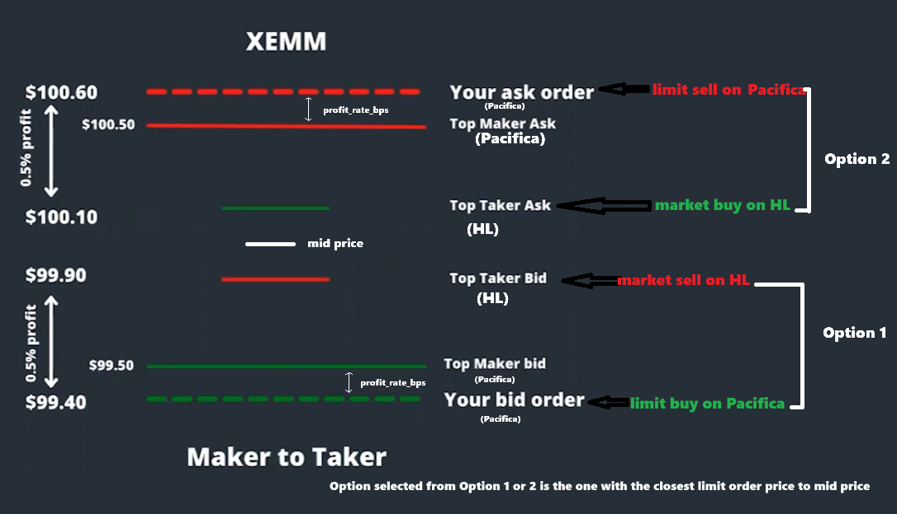

# XEMM Rust - Cross-Exchange Market Making Bot on Pacifica (Maker) and Hyperliquid (Taker)

A high-performance Rust trading bot that performs single-cycle arbitrage between Pacifica (maker) and Hyperliquid (taker). The bot continuously monitors orderbook feeds from both exchanges, places limit orders on Pacifica when profitable opportunities arise, and immediately hedges fills on Hyperliquid.
The main rationale is to use Hyperliquid's better liquidity, namely lower spreads, to do arbitrage trades on Pacifica immediately hedged on Hyperliquid.

## Architecture Overview

The diagram below illustrates the bot's trading idea:



Inspired by Hummingbot's XEMM Strategy.

**💰 Support this project**:
- **Hyperliquid**: Sign up with [this referral link](https://app.hyperliquid.xyz/join/FREQTRADE) for 10% fee reduction
- **Pacifica**: Sign up at [app.pacifica.fi](https://app.pacifica.fi/) and use one of the following referral codes when registering (if one is already taken, try another):
  ```
  411J9J7CYNFZN3SX
  2K7D40A9H53M2TJT
  S1G3A2063Q7410BV
  5KH0XDRD8BDGTBCT
  S1YHDS2GWAJTWJ4M
  7KB69JEC3BSA6GTR
  ```

## Features

### Core Trading
- ✅ **Real-time Arbitrage Detection** - Monitors both exchanges simultaneously
- ✅ **Automatic Order Placement** - Places limit orders on Pacifica when profitable
- ✅ **Instant Hedging** - Executes market orders on Hyperliquid after fills
- ✅ **Profit Monitoring** - Tracks and cancels orders if profit deviates
- ✅ **Order Refresh** - Auto-cancels stale orders based on age
- ✅ **Single-cycle Mode** - Exits after one successful arbitrage cycle

### Fill Detection (5 Layers)

The bot uses a multi-layered fill detection system for maximum reliability:

1. **WebSocket Fill Detection** (primary, real-time) - Monitors Pacifica's `account_order_updates` channel
2. **WebSocket Position Detection** (redundancy, real-time) - Monitors Pacifica's `account_positions` channel for position deltas
3. **REST API Order Polling** (backup, 500ms) - Polls order status via REST API
4. **Position Monitor** (ground truth, 500ms) - Detects fills by monitoring position changes via REST
5. **Monitor Safety Check** (defensive) - Pre-cancellation verification in monitoring task

All methods deduplicate via shared HashSet to ensure only one hedge executes per fill.

**Position-Based Detection Cross-Validation:**
- ✓ **Cross-validated** - Position change detected AND order update received (redundancy working)
- ⚠ **Not cross-validated** - Position change detected BUT no order update (safety net activated - primary missed it!)

### Exchange Connectivity

**Pacifica:**
- WebSocket orderbook (real-time bid/ask feed)
- WebSocket fill detection (monitors order fills/cancellations via `account_order_updates`)
- WebSocket position monitoring (detects fills from position changes via `account_positions`)
- WebSocket trading (ultra-fast order cancellation, no rate limits)
- REST API trading (authenticated order placement/cancellation)
- REST API polling (fallback orderbook data)
- REST API positions (position monitoring for fill detection)
- Ed25519 authenticated operations (both WebSocket and REST)
- **Dual cancellation safety** - Uses both REST + WebSocket for redundancy
- **Cross-validation** - Position-based detection validates order-based detection

**Hyperliquid:**
- WebSocket orderbook (real-time L2 book)
- REST API positions (clearinghouse state for position verification)
- EIP-712 authenticated trading (market orders)
- Automatic slippage protection

### Performance & Reliability
- ✅ **Multi-source Orderbook** - WebSocket primary, REST API fallback
- ✅ **Dual Cancellation** - REST + WebSocket cancellation on fill (defense in depth)
- ✅ **Auto-reconnect** - Exponential backoff on connection failures
- ✅ **Concurrent Tasks** - 7 async tasks running in parallel
- ✅ **High-frequency Monitoring** - 25ms profit checks, 100ms opportunity evaluation
- ✅ **Zero Rate Limits** - WebSocket cancellation bypasses API rate limits
- ✅ **Graceful Shutdown** - Cancels orders on Ctrl+C

### User Interface
- ✅ **Colorized Terminal Output** - Easy-to-read colored logs with section labels
- ✅ **Visual Status Indicators** - Green ✓ for success, Red ✗ for errors, Yellow ⚠ for warnings
- ✅ **Real-time Profit Display** - Color-coded profit changes (green = increasing, red = decreasing)
- ✅ **Comprehensive Trade Summary** - Beautiful formatted summary with emojis and colors on completion

## Quick Start

### 1. Set up credentials

Create a `.env` file with your API credentials:

```bash
# Pacifica credentials
PACIFICA_API_KEY=your_api_key
PACIFICA_SECRET_KEY=your_secret_key_base58
PACIFICA_ACCOUNT=your_account_address

# Hyperliquid credentials
HL_WALLET=your_wallet_address
HL_PRIVATE_KEY=your_private_key_hex
```

### 2. Configure bot parameters

Edit `config.json`:

```json
{
  "symbol": "SOL",
  "reconnect_attempts": 5,
  "ping_interval_secs": 15,
  "pacifica_maker_fee_bps": 1.5,
  "hyperliquid_taker_fee_bps": 4.0,
  "profit_rate_bps": 15.0,
  "order_notional_usd": 20.0,
  "profit_cancel_threshold_bps": 3.0,
  "order_refresh_interval_secs": 60,
  "hyperliquid_slippage": 0.05,
  "pacifica_rest_poll_interval_secs": 2
}
```

### 3. Run the bot

```bash
# Run the XEMM trading bot
cargo run

# With debug logging
RUST_LOG=debug cargo run

# In release mode (optimized)
cargo run --release
```

## Architecture

### Project Structure

```
src/
├── main.rs             # Main trading bot binary
├── lib.rs              # Library exports
├── config.rs           # Config management (loads config.json)
├── csv_logger.rs       # CSV logging for trade history
├── trade_fetcher.rs    # Post-hedge trade fetching and profit calculation
├── bot/
│   ├── mod.rs
│   └── state.rs        # Bot state machine (Idle/OrderPlaced/Filled/Hedging/Complete/Error)
├── strategy/
│   ├── mod.rs
│   └── opportunity.rs  # Opportunity evaluation and profit calculation
└── connector/
    ├── pacifica/
    │   ├── mod.rs
    │   ├── types.rs           # WebSocket/REST message types
    │   ├── client.rs          # Orderbook WebSocket client
    │   ├── trading.rs         # REST API trading (place/cancel orders)
    │   ├── ws_trading.rs      # WebSocket trading (ultra-fast cancel_all)
    │   └── fill_detection.rs  # WebSocket fill monitoring client
    └── hyperliquid/
        ├── mod.rs
        ├── types.rs           # Data structures
        ├── client.rs          # Orderbook WebSocket client
        └── trading.rs         # REST API trading (market orders)

examples/
├── pacifica_orderbook.rs                      # View Pacifica orderbook (live)
├── pacifica_orderbook_rest_test.rs            # Test REST API orderbook
├── fill_detection_test.rs                     # Test fill detection
├── test_aggressive_fill_detection.rs          # Test all 5 fill detection methods
├── hyperliquid_market_test.rs                 # Test Hyperliquid trading
├── hyperliquid_orderbook.rs                   # View Hyperliquid orderbook
├── xemm_calculator.rs                         # Price calculator (no trading)
├── test_pacifica_positions.rs                 # View Pacifica positions
├── check_positions_debug.rs                   # Debug Hyperliquid positions
├── test_hyperliquid_trade_history.rs          # Test trade history API
├── rebalancer.rs                              # Position rebalancer (single exchange)
├── rebalancer_cross_exchange.rs               # Cross-exchange rebalancer
├── cancel_all_test.rs                         # Test REST cancel all
├── ws_cancel_all_test.rs                      # Test WebSocket cancel all
└── ... (30+ more examples for testing)
```

### Bot State Machine

The bot uses a state machine to track lifecycle:

- **Idle** - Waiting for opportunity, no active order
- **OrderPlaced** - Order placed on Pacifica, monitoring for fill
- **Filled** - Order filled, waiting for hedge execution
- **Hedging** - Hedge being executed on Hyperliquid
- **Complete** - Cycle complete, bot exits
- **Error** - Unrecoverable error occurred

### 10 Concurrent Tasks

The XEMM bot orchestrates 10 async tasks running in parallel:

1. **Pacifica Orderbook (WebSocket)** - Real-time bid/ask feed
2. **Hyperliquid Orderbook (WebSocket)** - Real-time bid/ask feed
3. **Fill Detection (WebSocket)** - Monitors Pacifica order fills/cancellations (primary + position delta)
4. **Pacifica REST API Polling** - Fallback orderbook data (every 2s)
4.5. **Hyperliquid REST API Polling** - Fallback orderbook data (every 2s)
5. **REST API Fill Detection** - Backup fill polling (every 500ms)
5.5. **Position Monitor** - Position-based fill detection (every 500ms, ground truth)
6. **Order Monitoring** - Profit tracking and order refresh (every 25ms)
7. **Hedge Execution** - Executes Hyperliquid hedge after fill
8. **Main Opportunity Loop** - Evaluates and places orders (every 100ms)

## Configuration Parameters

| Parameter | Default | Description |
|-----------|---------|-------------|
| `symbol` | "SOL" | Trading symbol (must exist on both exchanges) |
| `reconnect_attempts` | 5 | Number of WebSocket reconnection attempts with exponential backoff |
| `ping_interval_secs` | 15 | WebSocket ping interval in seconds (max 30s) |
| `pacifica_maker_fee_bps` | 1.5 | Pacifica maker fee in basis points |
| `hyperliquid_taker_fee_bps` | 4.0 | Hyperliquid taker fee in basis points |
| `profit_rate_bps` | 15.0 | Target profit in basis points (0.15%), should overcome fees, slippage, and latency |
| `order_notional_usd` | 20.0 | Order size in USD |
| `profit_cancel_threshold_bps` | 3.0 | Cancel if profit deviates ±3 bps |
| `order_refresh_interval_secs` | 60 | Auto-cancel orders older than 60s |
| `hyperliquid_slippage` | 0.05 | Maximum slippage for market orders (5%) |
| `pacifica_rest_poll_interval_secs` | 2 | REST API fallback polling interval in seconds |

## Trading Workflow

1. **Startup**: Cancel all existing Pacifica orders
2. **Wait**: Gather initial orderbook data (3s warmup)
3. **Evaluate**: Check both BUY and SELL opportunities every 100ms
4. **Place**: If profitable (>target profit), place limit order on Pacifica
5. **Monitor**: Track profit every 25ms, cancel if deviation >3 bps or age >60s
6. **Fill Detection**: 5-layer system detects when order fills
   - WebSocket fill detection (primary, real-time via account_order_updates)
   - WebSocket position detection (redundancy, real-time via account_positions)
   - REST API order polling (backup, 500ms)
   - Position monitor (ground truth, 500ms via REST)
   - Monitor safety check (pre-cancellation)
   - **Dual Cancellation**: Immediately cancel all orders via REST + WebSocket
7. **Hedge**: Execute market order on Hyperliquid (opposite direction)
8. **Wait**: 20-second delay for trades to propagate to exchange APIs
9. **Fetch**: Retrieve actual fill data from both exchanges with retry logic
10. **Calculate**: Compute actual profit using real fills and fees
11. **Complete**: Display comprehensive profit summary and exit

## Opportunity Calculation

**Buy Opportunity** (Buy on Pacifica, Sell on Hyperliquid):
```
price = (HL_bid * (1 - taker_fee)) / (1 + maker_fee + profit_rate)
```

**Sell Opportunity** (Sell on Pacifica, Buy on Hyperliquid):
```
price = (HL_ask * (1 + taker_fee)) / (1 - maker_fee - profit_rate)
```

Prices are rounded to tick_size (buy rounds down, sell rounds up).

## Examples & Testing

### Core Examples

Essential examples for understanding and testing the system:

```bash
# View Pacifica orderbook (WebSocket live stream)
cargo run --example pacifica_orderbook --release

# Test Pacifica orderbook REST API
cargo run --example pacifica_orderbook_rest_test --release

# Test fill detection WebSocket
cargo run --example fill_detection_test --release

# Test REST API fill detection
cargo run --example test_rest_fill_detection --release

# Test Hyperliquid market orders
cargo run --example hyperliquid_market_test --release

# View Hyperliquid orderbook
cargo run --example hyperliquid_orderbook --release

# Test Hyperliquid L2 snapshot
cargo run --example test_hl_l2_snapshot --release

# Calculate opportunities without trading
cargo run --example xemm_calculator --release

# Advanced orderbook usage with statistics
cargo run --example advanced_usage --release

# Low-latency orderbook mode
cargo run --example low_latency --release
```

### Fill Detection Testing

Comprehensive test for the 5-layer fill detection system:

```bash
# Test all 5 fill detection methods with aggressive limit order
# Places order at 0.05% spread to ensure quick fill
# Verifies deduplication and position verification on both exchanges
cargo run --example test_aggressive_fill_detection --release
```

This test:
- Places an aggressive post-only limit order (5 bps spread)
- Monitors all 5 detection methods simultaneously:
  1. WebSocket order updates (primary)
  2. WebSocket position delta (redundancy)
  3. REST order polling (backup)
  4. REST position monitor (ground truth)
  5. Monitor pre-cancel check (defensive)
- Tracks which method detects first with timing analysis
- Shows cross-validation status for position-based detection
- Verifies only one hedge executes (deduplication works)
- Checks positions on both Pacifica and Hyperliquid after hedge
- Shows comprehensive detection method summary with timestamps

### Trading Examples

Generic trading examples (educational):

```bash
# Simple trading example
cargo run --example simple_trade --release

# More complex trading example
cargo run --example trading_example --release
```

### Utility Examples

Helper tools and utilities:

```bash
# Cancel all open orders (REST API)
cargo run --example cancel_all_test --release

# Test WebSocket cancel all orders
cargo run --example ws_cancel_all_test --release

# Check available Hyperliquid symbols
cargo run --example check_hyperliquid_symbols --release

# View current positions on Pacifica
cargo run --example test_pacifica_positions --release

# Debug Hyperliquid positions (raw API response)
cargo run --example check_positions_debug --release

# Close ENA position helper
cargo run --example close_ena_position --release

# Verify wallet/credentials
cargo run --example verify_wallet --release

# Debug MessagePack serialization
cargo run --example debug_msgpack --release

# Test metadata parsing
cargo run --example test_meta --release
cargo run --example test_meta_parse --release

# Test price rounding logic
cargo run --example test_price_rounding --release

# Fetch and analyze recent trade history
cargo run --example fetch_recent_trades --release
cargo run --example fetch_pump_trades --release
cargo run --example test_hyperliquid_trade_history --release
cargo run --example test_pacifica_trade_history --release

# Cross-exchange position rebalancer
cargo run --example rebalancer --release
cargo run --example rebalancer_cross_exchange --release
```

### Symbol-Specific Test Examples

Order placement tests for specific coins:

```bash
# Test orders for different symbols
cargo run --example test_btc_orders --release
cargo run --example test_eth_orders --release
cargo run --example test_pengu_orders --release
cargo run --example test_pump_orders --release
cargo run --example test_xpl_orders --release
```

## Development Commands

```bash
# Check compilation
cargo check

# Build (debug)
cargo build

# Build (release/optimized)
cargo build --release

# Run main XEMM bot
cargo run
RUST_LOG=debug cargo run  # With debug logging

# Run tests
cargo test
cargo test --lib  # Library tests only
```

## Terminal Output

The bot features colorized terminal output for easy monitoring:

### Color Scheme
- **Section Labels**: Color-coded by task type
  - `[CONFIG]` - Blue (configuration values)
  - `[INIT]` - Cyan (initialization steps)
  - `[PACIFICA_OB]` / `[HYPERLIQUID_OB]` - Magenta (orderbook feeds)
  - `[FILL_DETECTION]` - Magenta (fill events)
  - `[MONITOR]` - Yellow (profit monitoring)
  - `[PROFIT]` - Bright blue (profit updates)
  - `[OPPORTUNITY]` - Bright green (arbitrage opportunities)
  - `[ORDER]` - Bright yellow (order placement)
  - `[HEDGE]` - Bright magenta (hedge execution)
  - `[SHUTDOWN]` - Yellow (cleanup)

- **Status Indicators**:
  - ✓ Green - Success
  - ✗ Red - Error/Failure
  - ⚠ Yellow - Warning

- **Trading Data**:
  - Prices: Cyan
  - BUY orders: Green
  - SELL orders: Red
  - Profit increasing: Green
  - Profit decreasing: Red
  - Symbols: Bright white bold
  - Fees: Yellow

### Example Output
```
[INIT] ✓ Credentials loaded successfully
[OPPORTUNITY] BUY @ $156.12 → HL $156.35 | Profit: 12.50 bps
[ORDER] ✓ Placed BUY #12345 @ $156.12 | cloid: abc123...xyz9
[FILL_DETECTION] ✓ FULL FILL: buy 0.1281 SOL @ $156.12
[SOL HEDGE] Executing SELL 0.1281 on Hyperliquid
[SOL HEDGE] ✓ Hedge executed successfully
═══════════════════════════════════════════════════
  BOT CYCLE COMPLETE!
═══════════════════════════════════════════════════
```

## Important Notes

- **Mainnet only**: Production system, uses real funds
- **Single-cycle**: Bot exits after one successful hedge
- **No position accumulation**: Always hedges immediately after fill
- **Graceful shutdown**: Ctrl+C cancels remaining orders before exit
- **Credentials**: Never commit `.env` file to version control
- **Testing**: Always test with small `order_notional_usd` first (e.g., 5.0)
