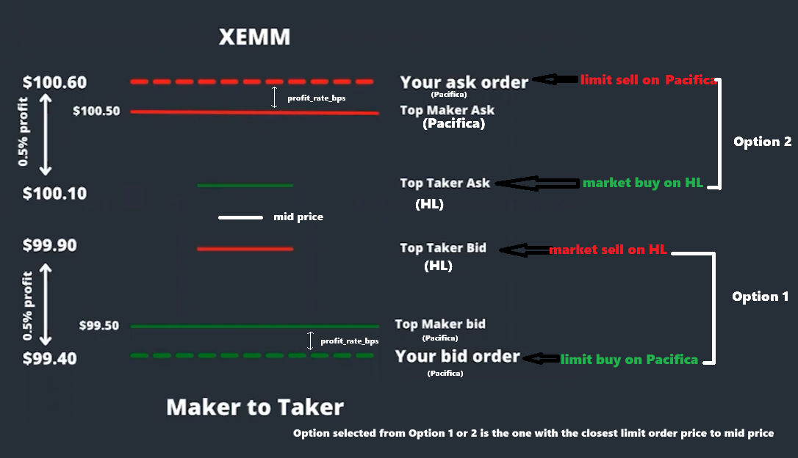

# XEMM Rust - Cross-Exchange Market Making Bot on Pacifica (Maker) and Hyperliquid (Taker)

A high-performance Rust trading bot that performs arbitrage between Pacifica (maker) and Hyperliquid (taker). The bot continuously monitors orderbook feeds from both exchanges, places limit orders on Pacifica when profitable opportunities arise, and immediately hedges fills on Hyperliquid.
The main rationale is to use Hyperliquid's better liquidity, namely lower spreads, to do arbitrage trades on Pacifica immediately hedged on Hyperliquid.

## Architecture Overview

The diagram below illustrates the bot's trading idea. We arbitrage the fact that the bid-ask spread is often tighter on Hyperliquid than on Pacifica because Hyperliquid has better liquidity. This is better than classical taker-to-taker arbitrage because:
* there are more such opportunities
* in taker-to-taker arbitrage, it is very hard or even impossible to compete on latency with professionals and exchanges
* you are arbitraging your own limit order price, so you may have a latency advantage

Run on *AWS Tokyo* to have the best latency.


Here, `profit_rate_bps` is actually a safety margin on top of a theoretically profitable maker-taker trade, to compensate for fees, slippage and latency.

This bot is Inspired by Hummingbot's XEMM Strategy.

**$ Support this project**:
- **Hyperliquid**: Sign up with [this referral link](https://app.hyperliquid.xyz/join/FREQTRADE) for 10% fee reduction
- **Pacifica**: Sign up at [app.pacifica.fi](https://app.pacifica.fi/) and use one of the following referral codes when registering (if one is already taken, try another):
  ```
  411J9J7CYNFZN3SX
  2K7D40A9H53M2TJT
  S1G3A2063Q7410BV
  5KH0XDRD8BDGTBCT
  S1YHDS2GWAJTWJ4M
  7KB69JEC3BSA6GTR
  ```

## Features

### Core Trading
- OK **Real-time Arbitrage Detection** - Monitors both exchanges simultaneously
- OK **Automatic Order Placement** - Places limit orders on Pacifica when profitable
- OK **Instant Hedging** - Executes market orders on Hyperliquid after fills
- OK **Profit Monitoring** - Tracks and cancels orders if profit deviates
- OK **Order Refresh** - Auto-cancels stale orders based on age
- OK **Single-cycle Mode** - Exits after one successful arbitrage cycle

### Fill Detection (5 Layers)

The bot uses a multi-layered fill detection system for maximum reliability:

1. **WebSocket Fill Detection** (primary, real-time) - Monitors Pacifica's `account_order_updates` channel
2. **WebSocket Position Detection** (redundancy, real-time) - Monitors Pacifica's `account_positions` channel for position deltas
3. **REST API Order Polling** (backup, 500ms) - Polls order status via REST API
4. **Position Monitor** (ground truth, 500ms) - Detects fills by monitoring position changes via REST
5. **Monitor Safety Check** (defensive) - Pre-cancellation verification in monitoring task

All methods deduplicate via shared HashSet to ensure only one hedge executes per fill.

### Exchange Connectivity

**Pacifica:**
- WebSocket orderbook (real-time bid/ask feed)
- WebSocket fill detection (monitors order fills/cancellations via `account_order_updates`)
- WebSocket position monitoring (detects fills from position changes via `account_positions`)
- WebSocket trading (ultra-fast order cancellation, no rate limits)
- REST API trading (authenticated order placement/cancellation)
- REST API polling (fallback orderbook data)
- REST API positions (position monitoring for fill detection)
- Ed25519 authenticated operations (both WebSocket and REST)
- **Dual cancellation safety** - Uses both REST + WebSocket for redundancy
- **Cross-validation** - Position-based detection validates order-based detection

**Hyperliquid:**
- WebSocket orderbook (real-time L2 book)
- REST API positions (clearinghouse state for position verification)
- EIP-712 authenticated trading (market orders)
- Automatic slippage protection
- **WebSocket trading for hedges (default)** - Hedge market orders are sent as signed `post` actions over the Hyperliquid WebSocket for minimal latency, with REST fallback on error.

### Hedge Execution Architecture

This development branch introduces a low-latency, queue-based hedge pipeline and WebSocket-based Hyperliquid execution:

- **Hedge event queue (non-blocking)**  
  - All fill-detection layers (`FillDetectionService`, `RestFillDetectionService`, `PositionMonitorService`) act as **producers** and push `HedgeEvent`s into a **bounded** Tokio `mpsc` channel (capacity 256).  
  - Producers never block: they use `try_send`, and on the (unexpected) event of a full or closed queue the intent is persisted to a local JSONL file and maker placement is halted via the `Reconciling`/`Error` state, so exposure is never silently dropped.

- **Dedicated hedge executor task**  
  - `HedgeService` runs in its own async task and acts as a **single consumer** of the hedge event queue.  
  - It awaits `hedge_rx.recv().await`, so as soon as an event arrives, the hedge flow starts; there is no polling interval.

- **WebSocket-first Hyperliquid hedging**  
  - On startup, `HedgeService` establishes a dedicated Hyperliquid trading WebSocket connection and keeps it alive for hedging.  
  - Hedge orders are built and signed once (shared logic), then wrapped in a WS `post` request (`type: "action"`) and sent over the hot WebSocket.
  - WS responses are parsed into the same `OrderResponse` type as REST, so the downstream profit and verification logic is unchanged.
  - If WS execution fails for a given hedge (connection error or WS-level error), the bot **falls back to REST** for that hedge and logs the reason.

- **Config toggle: WS vs REST**  
  - `Config.hyperliquid_use_ws_for_hedge` (default: `true`) controls the execution path:  
    - `true` -> use WebSocket for hedging, with REST fallback on error.  
    - `false` -> use REST-only hedging (original behavior).

### Performance & Reliability
- OK **Multi-source Orderbook** - WebSocket primary, REST API fallback
- OK **Dual Cancellation** - REST + WebSocket cancellation on fill (defense in depth)
- OK **Auto-reconnect** - Exponential backoff on connection failures
- OK **Concurrent Tasks** - 10 async tasks running in parallel
- OK **High-frequency Monitoring** - ~1ms (1 kHz) profit checks and opportunity evaluation (gated by quote freshness, rate limits, and run state)
- OK **Zero Rate Limits** - WebSocket cancellation bypasses API rate limits
- OK **Graceful Shutdown** - Cancels orders on Ctrl+C

### User Interface
- OK **Colorized Terminal Output** - Easy-to-read colored logs with section labels
- OK **Visual Status Indicators** - Green OK for success, Red FAIL for errors, Yellow WARN for warnings
- OK **Real-time Profit Display** - Color-coded profit changes (green = increasing, red = decreasing)
- OK **Comprehensive Trade Summary** - Beautiful formatted summary with emojis and colors on completion

## Quick Start

### 1. Set up credentials

Create a `.env` file with your API credentials (see `.env.example`):

```bash
# Pacifica credentials
SOL_WALLET=your_main_wallet_address      # Pacifica account address
API_PUBLIC=your_agent_wallet_public_key  # Agent (API) wallet public key
API_PRIVATE=your_agent_wallet_private_key_base58

# Hyperliquid credentials
HL_PRIVATE_KEY=your_private_key_hex      # signing key; the address is derived from it
HL_WALLET=0xyour_account_address         # optional: account to trade/query if it differs
                                         # from the key-derived signing wallet (agent wallets)
```

### 2. Configure bot parameters

Edit `config.json`:

```json
{
  "symbol": "SOL",
  "reconnect_attempts": 5,
  "ping_interval_secs": 15,
  "pacifica_maker_fee_bps": 1.5,
  "hyperliquid_taker_fee_bps": 4.0,
  "profit_rate_bps": 15.0,
  "order_notional_usd": 20.0,
  "profit_cancel_threshold_bps": 3.0,
  "order_refresh_interval_secs": 60,
  "hyperliquid_slippage": 0.05,
  "pacifica_rest_poll_interval_secs": 2
}
```

### 3. Run the bot

```bash
# Run the XEMM trading bot. Warning: This will perform only one cycle (one maker order filled on Pacifica and then hedged ASAP on Hyperliquid). Use `run_bot_loop_cargo.sh` to run cycles continuously.
cargo run

# With debug logging
RUST_LOG=debug cargo run

# In release mode (optimized, full performance)
cargo run --release
```

## Architecture

### Project Structure

```
src/
├── main.rs             # Main trading bot binary
├── lib.rs              # Library exports
├── config.rs           # Config management (loads config.json)
├── csv_logger.rs       # CSV logging for trade history
├── trade_fetcher.rs    # Post-hedge trade fetching and profit calculation
├── bot/
│   ├── mod.rs
│   └── state.rs        # Bot state machine (Idle/OrderPlaced/Filled/Hedging/Complete/Error)
├── strategy/
│   ├── mod.rs
│   └── opportunity.rs  # Opportunity evaluation and profit calculation
└── connector/
    ├── pacifica/
    │   ├── mod.rs
    │   ├── types.rs           # WebSocket/REST message types
    │   ├── client.rs          # Orderbook WebSocket client
    │   ├── trading.rs         # REST API trading (place/cancel orders)
    │   ├── ws_trading.rs      # WebSocket trading (ultra-fast cancel_all)
    │   └── fill_detection.rs  # WebSocket fill monitoring client
    └── hyperliquid/
        ├── mod.rs
        ├── types.rs           # Data structures
        ├── client.rs          # Orderbook WebSocket client
        └── trading.rs         # REST API trading (market orders)

examples/
├── pacifica_orderbook.rs                      # View Pacifica orderbook (live)
├── pacifica_orderbook_rest_test.rs            # Test REST API orderbook
├── fill_detection_test.rs                     # Test fill detection
├── test_aggressive_fill_detection.rs          # Test all 5 fill detection methods
├── hyperliquid_market_test.rs                 # Test Hyperliquid trading
├── hyperliquid_orderbook.rs                   # View Hyperliquid orderbook
├── xemm_calculator.rs                         # Price calculator (no trading)
├── test_pacifica_positions.rs                 # View Pacifica positions
├── check_positions_debug.rs                   # Debug Hyperliquid positions
├── test_hyperliquid_trade_history.rs          # Test trade history API
├── rebalancer.rs                              # Position rebalancer (single exchange)
├── rebalancer_cross_exchange.rs               # Cross-exchange rebalancer
├── cancel_all_test.rs                         # Test REST cancel all
├── ws_cancel_all_test.rs                      # Test WebSocket cancel all
└── ... (30+ more examples for testing)
```

### Bot State Machine

The bot uses a state machine to track lifecycle:

- **Idle** - Waiting for opportunity, no active order
- **OrderPlaced** - Order placed on Pacifica, monitoring for fill
- **Filled** - Order filled, waiting for hedge execution
- **Hedging** - Hedge being executed on Hyperliquid
- **Complete** - Cycle complete, bot exits
- **Error** - Unrecoverable error occurred

### Concurrent Tasks

The XEMM bot orchestrates 10 async tasks running in parallel:

1. **Pacifica Orderbook (WebSocket)** - Real-time bid/ask feed
2. **Hyperliquid Orderbook (WebSocket)** - Real-time bid/ask feed
3. **Fill Detection (WebSocket)** - Monitors Pacifica order fills/cancellations (primary + position delta); a single ordered processor task consumes fill events
4. **Pacifica REST API Polling** - Fallback orderbook data (every 2s)
5. **Hyperliquid REST API Polling** - Fallback orderbook data (every 2s)
6. **REST API Fill Detection** - Backup fill polling (every 500ms)
7. **Position Monitor** - Position-based fill detection (every 500ms, ground truth)
8. **Order Monitoring** - Profit tracking and order refresh (event-driven on book updates, 5ms fallback tick)
9. **Hedge Execution** - Executes Hyperliquid hedge after fill
10. **Main Opportunity Loop** - Evaluates and places orders (event-driven on book updates, 10ms fallback tick, gated)

### Operational Invariants (do not change casually)

- **`panic = "unwind"` must stay** (it is the cargo default; do NOT set
  `panic = "abort"` in `[profile.release]`). Both supervisors detect task
  panics via `JoinError` to drive the fail-closed `ServiceDown` latch and the
  restart-with-backoff logic; abort would bypass that entire safety design.
- **The fill WebSocket reconnects forever** (`max_attempts: None` internally).
  A healthy connection (≥10s uptime) resets the attempt budget; server-side
  closes are reconnect triggers, never a permanent stop. Quoting is gated by
  `FillWsDown` during gaps and the reconcile hook replays missed fills on
  reconnect. Only a genuine panic latches the fail-closed `ServiceDown` stop.
- **`./data` must be volume-mounted in Docker.** `data/unresolved_exposure.jsonl`
  (shutdown exposure marker) and `data/hedge_lifecycle.jsonl` (hedge intent
  journal) are the durable audit/recovery records; startup additionally
  re-checks live venue positions unconditionally.
- **Unknown-outcome hedges are quarantined**, not retried by the order-based
  paths: if a hedge submit ends uncertain (response lost, orderStatus
  inconclusive), the quantity is excluded from residual re-emission and only
  the position reconciler (venue truth, ~1s cadence) recovers it. This is what
  makes a double-hedge of an actually-filled uncertain attempt impossible.
- **`shutdown_drain_timeout_secs`** (default 5) bounds how long shutdown waits
  for in-flight hedges to settle before final cancellation.

## Configuration Parameters

| Parameter | Default | Description |
|-----------|---------|-------------|
| `symbol` | "SOL" | Trading symbol (must exist on both exchanges) |
| `maker_venue` | "pacifica" | Maker exchange. Currently only `pacifica`; the maker side is abstracted behind the `build_maker` factory so a new venue is one added arm (Hyperliquid stays the permanent taker). |
| `maker_symbol` | (unset) | Optional maker-venue wire symbol when it differs from `symbol`. Defaults to `symbol`; the connector maps canonical `symbol` <-> wire internally. |
| `reconnect_attempts` | 5 | Number of WebSocket reconnection attempts with exponential backoff |
| `agg_level` | 1 | Orderbook aggregation level (1, 2, 5, 10, 100, 1000) |
| `ping_interval_secs` | 15 | WebSocket ping interval in seconds (max 30s) |
| `low_latency_mode` | false | Low-latency mode: minimal logging and processing |
| `pacifica_maker_fee_bps` | 1.5 | Pacifica maker fee in basis points |
| `hyperliquid_taker_fee_bps` | 4.0 | Hyperliquid taker fee in basis points |
| `profit_rate_bps` | 15.0 | Target profit in basis points (0.15%), should overcome fees, slippage, and latency |
| `order_notional_usd` | 20.0 | Order size in USD |
| `profit_cancel_threshold_bps` | 3.0 | Cancel if profit deviates +/-3 bps |
| `order_refresh_interval_secs` | 60 | Auto-cancel orders older than 60s |
| `hyperliquid_slippage` | 0.05 | Maximum slippage for market orders (5%) |
| `hyperliquid_use_ws_for_hedge` | true | Use WebSocket for hedge execution (faster) vs REST |
| `pacifica_rest_poll_interval_secs` | 2 | REST API fallback polling interval in seconds |
| `pacifica_ws_request_timeout_ms` | 2000 | Pacifica trading-WS request/response timeout (placement is post-only, so tighter is safe) |
| `shutdown_drain_timeout_secs` | 5 | How long shutdown waits for in-flight hedges to drain |

## Trading Workflow

1. **Startup**: Cancel all existing Pacifica orders
2. **Wait**: Gather initial orderbook data (3s warmup)
3. **Evaluate**: Check both BUY and SELL opportunities every ~1ms (1 kHz), gated by quote freshness/rate limits/run state
4. **Calculate & Place**: Calculate Pacifica limit price from Hyperliquid hedge price with target profit margin (`profit_rate_bps`) embedded, place order if still profitable after rounding
5. **Monitor**: Track profit every ~1ms (1 kHz), cancel if deviation >3 bps or age >60s
6. **Fill Detection**: 5-layer system detects when order fills
   - WebSocket fill detection (primary, real-time via account_order_updates)
   - WebSocket position detection (redundancy, real-time via account_positions)
   - REST API order polling (backup, 500ms)
   - Position monitor (ground truth, 500ms via REST)
   - Monitor safety check (pre-cancellation)
   - **Dual Cancellation**: Immediately cancel all orders via REST + WebSocket
7. **Hedge**: Execute market order on Hyperliquid (opposite direction)
8. **Wait**: 20-second delay for trades to propagate to exchange APIs
9. **Fetch**: Retrieve actual fill data from both exchanges with retry logic
10. **Calculate**: Compute actual profit using real fills and fees
11. **Complete**: Display comprehensive profit summary and exit

## Opportunity Calculation

**Buy Opportunity** (Buy on Pacifica, Sell on Hyperliquid):
```
price = (HL_bid * (1 - taker_fee)) / (1 + maker_fee + profit_rate)
```

**Sell Opportunity** (Sell on Pacifica, Buy on Hyperliquid):
```
price = (HL_ask * (1 + taker_fee)) / (1 - maker_fee - profit_rate)
```

Prices are rounded to tick_size (buy rounds down, sell rounds up).

## Examples & Testing

### Core Examples

Essential examples for understanding and testing the system:

```bash
# View Pacifica orderbook (WebSocket live stream)
cargo run --example pacifica_orderbook --release

# Test Pacifica orderbook REST API
cargo run --example pacifica_orderbook_rest_test --release

# Test fill detection WebSocket
cargo run --example fill_detection_test --release

# Test REST API fill detection
cargo run --example test_rest_fill_detection --release

# Test Hyperliquid market orders
cargo run --example hyperliquid_market_test --release

# View Hyperliquid orderbook
cargo run --example hyperliquid_orderbook --release

# Test Hyperliquid L2 snapshot
cargo run --example test_hl_l2_snapshot --release

# Calculate opportunities without trading
cargo run --example xemm_calculator --release
```

### Fill Detection Testing

Comprehensive test for the 5-layer fill detection system:

```bash
# Test all 5 fill detection methods with aggressive limit order
# Places order at 0.05% spread to ensure quick fill
# Verifies deduplication and position verification on both exchanges
cargo run --example test_aggressive_fill_detection --release
```

This test:
- Places an aggressive post-only limit order (5 bps spread)
- Monitors all 5 detection methods simultaneously:
  1. WebSocket order updates (primary)
  2. WebSocket position delta (redundancy)
  3. REST order polling (backup)
  4. REST position monitor (ground truth)
  5. Monitor pre-cancel check (defensive)
- Tracks which method detects first with timing analysis
- Shows cross-validation status for position-based detection
- Verifies only one hedge executes (deduplication works)
- Checks positions on both Pacifica and Hyperliquid after hedge
- Shows comprehensive detection method summary with timestamps

### Utility Examples

Helper tools and utilities:

```bash
# Cancel all open orders (REST API)
cargo run --example cancel_all_test --release

# Test WebSocket cancel all orders
cargo run --example ws_cancel_all_test --release

# Check available Hyperliquid symbols
cargo run --example check_hyperliquid_symbols --release

# View current positions on Pacifica
cargo run --example test_pacifica_positions --release

# Debug Hyperliquid positions (raw API response)
cargo run --example check_positions_debug --release

# Close ENA position helper
cargo run --example close_ena_position --release

# Verify wallet/credentials
cargo run --example verify_wallet --release

# Debug MessagePack serialization
cargo run --example debug_msgpack --release

# Test metadata parsing
cargo run --example test_meta --release
cargo run --example test_meta_parse --release

# Test price rounding logic
cargo run --example test_price_rounding --release

# Fetch and analyze recent trade history
cargo run --example fetch_recent_trades --release
cargo run --example fetch_pump_trades --release
cargo run --example test_hyperliquid_trade_history --release
cargo run --example test_pacifica_trade_history --release

# Cross-exchange position rebalancer
cargo run --example rebalancer --release
cargo run --example rebalancer_cross_exchange --release
```

### Symbol-Specific Test Examples

Order placement tests for specific coins:

```bash
# Test orders for different symbols
cargo run --example test_btc_orders --release
cargo run --example test_eth_orders --release
cargo run --example test_pengu_orders --release
cargo run --example test_pump_orders --release
cargo run --example test_xpl_orders --release
```

## Standalone Utilities

The `standalone-utils/` folder contains self-contained JavaScript and Python utilities for monitoring and managing trading operations. These utilities can be copied and run independently anywhere.

### Available Utilities

**JavaScript Utilities:**
- **`get-recent-fills.js`** - Fetch and display recent filled orders from both exchanges with PnL tracking
- **`cleanup-all-positions.js`** - Emergency script to flatten all open positions on both exchanges
- **`cancel-all-orders.js`** - Cancel all outstanding orders on Pacifica

**Python Dashboard:**
- **`dashboard/`** - Real-time terminal dashboard for monitoring:
  - Live orderbook feeds from both exchanges
  - Position tracking and PnL calculation
  - Order status and fill detection
  - Cross-exchange spread visualization

### Quick Setup

```bash
# Navigate to utilities folder
cd standalone-utils/

# Install JavaScript dependencies
npm install

# Setup credentials
cp .env.example .env
# Edit .env with your API keys

# Run utilities
node get-recent-fills.js        # View recent fills
node cleanup-all-positions.js   # Emergency position cleanup
```

**For Python Dashboard:**
```bash
cd standalone-utils/dashboard/
pip install -r requirements.txt
cp .env.example .env
# Edit .env with credentials
python dashboard.py
```

See `standalone-utils/README.md` for detailed documentation, configuration options, and troubleshooting.

## Web Dashboard

The `dashboard_js/` directory contains a Node.js web dashboard for remote monitoring and control of the bot.

### Features
- **Real-time Status** - Monitor bot status (Running/Stopped) with accurate process detection
- **Remote Control** - Start, stop, and deploy bot from your browser
- **Live Logs** - Auto-refreshing log viewer with ANSI color support
- **Trade History** - View recent trades with PnL statistics
- **Configuration** - Display current bot configuration

### Quick Setup

```bash
cd dashboard_js
npm install
node server.js
# Open http://localhost:3000 in your browser
```

The dashboard connects to your remote server via SSH to execute commands and fetch data. Configure the remote server details in `server.js`.

See `dashboard_js/README.md` for detailed documentation, API endpoints, and troubleshooting.

## Running on Linux/AWS VPS

The repository includes bash scripts for easy deployment on Linux systems (e.g., AWS VPS):

### Single Cycle (Background)

Run one complete arbitrage cycle in the background with nohup:

```bash
bash run_nohup.sh
```

This runs the bot in the background, logs output to `output.log`, and exits after one successful fill + hedge cycle.

### Continuous Loop (Multiple Cycles)

Run the bot continuously, restarting automatically after each cycle:

```bash
bash run_bot_loop_cargo.sh
```

This script:
- Runs the bot in an infinite loop
- Waits 20 seconds between cycles
- Automatically restarts after each successful fill + hedge
- Rebuilds on each run (picks up code changes)
- Shows colorized output with cycle numbers and timestamps
- Press `Ctrl+C` to stop

### Stop All Bot Processes

Kill all running bot processes (single or loop mode):

```bash
bash kill_process.sh
```

This stops:
- The `xemm_rust` binary (if running)
- The `run_bot_loop_cargo.sh` script (if running in loop mode)
- Any `cargo` processes spawned by the loop

## Development Commands

```bash
# Check compilation
cargo check

# Build (debug)
cargo build

# Build (release/optimized)
cargo build --release

# Run main XEMM bot
cargo run
RUST_LOG=debug cargo run  # With debug logging

# Run tests
cargo test
cargo test --lib  # Library tests only
```

## Validating a Run (`verify_run.py`)

`verify_run.py` (repo root, Python 3 stdlib only) is a **post-run validator**: after the bot completes a cycle it reads the captured stdout log plus the structured journals and asserts the cycle behaved correctly, exiting non-zero if anything is off. Use it as a routine post-cycle sanity check — and especially to **sign off a maker-venue migration before trading at normal size**.

> **Why this matters for the maker abstraction.** The maker side (Pacifica) is built behind a swap point — the `MakerExchange` / `MakerFillStream` traits and the `build_maker` factory in `src/connector/maker_factory.rs` — so a new maker venue is one added arm with no service or hot-path changes; Hyperliquid stays the permanent taker. Such a change is behavior-preserving and unit-tested, but only a real cycle exercises the live WS/REST flows. There is **no testnet**: validate with **one mainnet cycle at minimum size**, bounded by the venue minimum notional and the bot's own auto-hedge/exit safety.

### What it checks

| Check | Source | Asserts |
|-------|--------|---------|
| `cycle_sequence` | stdout log | `place -> fill -> hedge received -> hedge executed`, in order |
| `clean_exit` | stdout log | a clean shutdown was logged, not "terminated with error" |
| `no_anomalies` | stdout log | no `panicked` / `Placement remains unknown` / `cannot auto-hedge` / unresolved-exposure lines. Recoverable signals (e.g. a retried `Hedge order FAILED`) are reported as `WARN`, not failures |
| `hedge_lifecycle` | `data/hedge_lifecycle.jsonl` | every hedge intent reached a terminal **success**; maker/hedge sides opposite; `filled_qty ≈ size` |
| `trade_accounting` | `<symbol>_trades.csv` | the audit row is self-consistent: opposite sides, matching sizes, fees present, `gross_pnl` recomputes from the notionals |
| `net_neutral` | `data/unresolved_exposure.jsonl` | no unresolved-exposure record or log line |

The journals are append-only and accumulate across runs, so journal checks are scoped to the most recent cycle (last ~15 min). Pass `--since-ms <epoch_ms>` to pin an exact window, or `--window-min N` to widen it.

### Procedure

1. **Pre-flight** — `cargo build --release` and `cargo test --lib` (expect all lib tests passing); `.env` holds credentials for **both** venues; fund both with a small buffer over the order notional.
2. **Configure minimum size** — in `config.json`, set `order_notional_usd` to the symbol's minimum notional (startup rejects anything below it via `Config::validate`). **Keep `low_latency_mode: false`** — low-latency mode suppresses the human-readable event lines the `cycle_sequence` check reads. Optionally lower `profit_rate_bps` so a maker quote fills sooner during the test (quotes nearer break-even, a few cents of real cost — revert it afterwards).
3. **Run one cycle and capture stdout** — the bot is single-cycle (place -> fill -> hedge -> ~20s audit -> exit):

   ```bash
   cargo run --release 2>&1 | tee output.log                  # bash / Linux
   ```
   ```powershell
   cargo run --release 2>&1 | Tee-Object -FilePath output.log  # PowerShell
   ```

   If no fill happens within a few minutes (the market never crossed your quote), stop it and re-run — without a fill there is no cycle to validate.
4. **Validate**:

   ```bash
   python verify_run.py --log output.log    # --symbol is auto-detected from config.json
   ```
   ```
   [PASS] cycle_sequence     placed=1 fill=1 hedge_received=1 hedge_ok=1
   [PASS] clean_exit         clean shutdown logged
   [PASS] no_anomalies       none
   [PASS] hedge_lifecycle    1 intent(s): 1 complete, 0 skipped
   [PASS] trade_accounting   1 row(s) self-consistent
   [PASS] net_neutral        no unresolved exposure
   VERDICT: PASS
   ```

   Exit code is `0` on PASS, `1` on FAIL. **On FAIL, do not trade at larger size** — read the failing check's detail and inspect `output.log` and `data/hedge_lifecycle.jsonl`.

### Optional: old-build vs new-build equivalence

To answer "did the refactor change behavior?", run one cycle on each build and compare the `--json` summaries — the **event sequence + invariants**, not raw market values (which differ every run):

```bash
git checkout 31318d3 && cargo run --release 2>&1 | tee pre.log    # last pre-refactor commit
python verify_run.py --log pre.log --json > pre.json
git checkout master  && cargo run --release 2>&1 | tee post.log
python verify_run.py --log post.log --json > post.json
```

Both should report `"verdict": "PASS"` with the same checks passing and comparable accounting. `verify_run.py` is committed, so it survives the checkout. Run the harness right after each cycle (or pass `--since-ms`) so the most-recent-cycle window keeps the two runs separate.

### Safety / recovery

The bot's existing protections cover a stuck cycle: the position reconciler retries corrective hedges, `data/unresolved_exposure.jsonl` is written on a non-neutral shutdown, and fail-closed supervisors halt quoting on a crashed critical service. If `verify_run.py` reports `net_neutral FAIL` or you see unresolved exposure, flatten before retrying:

```bash
cargo run --release --bin check_balance   # inspect positions on both venues
cargo run --release --bin rebalance       # flatten residual exposure
```

## Terminal Output

The bot features colorized terminal output for easy monitoring:

### Color Scheme
- **Section Labels**: Color-coded by task type
  - `[CONFIG]` - Blue (configuration values)
  - `[INIT]` - Cyan (initialization steps)
  - `[PACIFICA_OB]` / `[HYPERLIQUID_OB]` - Magenta (orderbook feeds)
  - `[FILL_DETECTION]` - Magenta (fill events)
  - `[MONITOR]` - Yellow (profit monitoring)
  - `[PROFIT]` - Bright blue (profit updates)
  - `[OPPORTUNITY]` - Bright green (arbitrage opportunities)
  - `[ORDER]` - Bright yellow (order placement)
  - `[HEDGE]` - Bright magenta (hedge execution)
  - `[SHUTDOWN]` - Yellow (cleanup)

- **Status Indicators**:
  - OK Green - Success
  - FAIL Red - Error/Failure
  - WARN Yellow - Warning

- **Trading Data**:
  - Prices: Cyan
  - BUY orders: Green
  - SELL orders: Red
  - Profit increasing: Green
  - Profit decreasing: Red
  - Symbols: Bright white bold
  - Fees: Yellow

### Example Output
```
[INIT] OK Credentials loaded successfully
[OPPORTUNITY] BUY @ $156.12 -> HL $156.35 | Profit: 12.50 bps
[ORDER] OK Placed BUY #12345 @ $156.12 | cloid: abc123...xyz9
[FILL_DETECTION] OK FULL FILL: buy 0.1281 SOL @ $156.12
[SOL HEDGE] Executing SELL 0.1281 on Hyperliquid
[SOL HEDGE] OK Hedge executed successfully
═══════════════════════════════════════════════════
  BOT CYCLE COMPLETE!
═══════════════════════════════════════════════════
```

## Important Notes

- **Mainnet only**: Production system, uses real funds
- **Single-cycle**: Bot exits after one successful hedge
- **No position accumulation**: Always hedges immediately after fill
- **Graceful shutdown**: Ctrl+C cancels remaining orders before exit
- **Credentials**: Never commit `.env` file to version control
- **Testing**: Always test with small `order_notional_usd` first (e.g., 12.0)
- **Deployment**: Run on AWS Tokyo to have the best latency, latency is critical
